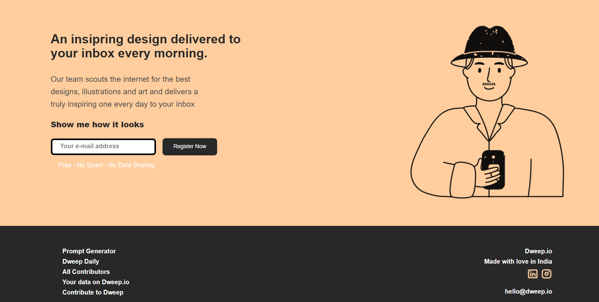

# Project 1

This is a project using HTML and CSS. Mainly here we learnt about CSS flexbox and CSS positioning to build a landing page.

 

## Deployed Link: [Click Here](https://dweepio.netlify.app/)

###  🔸 Site works best on 15-Inch monitor. Site is not responsive.

 

## Tech Stacks
 

 

## Screenshots

